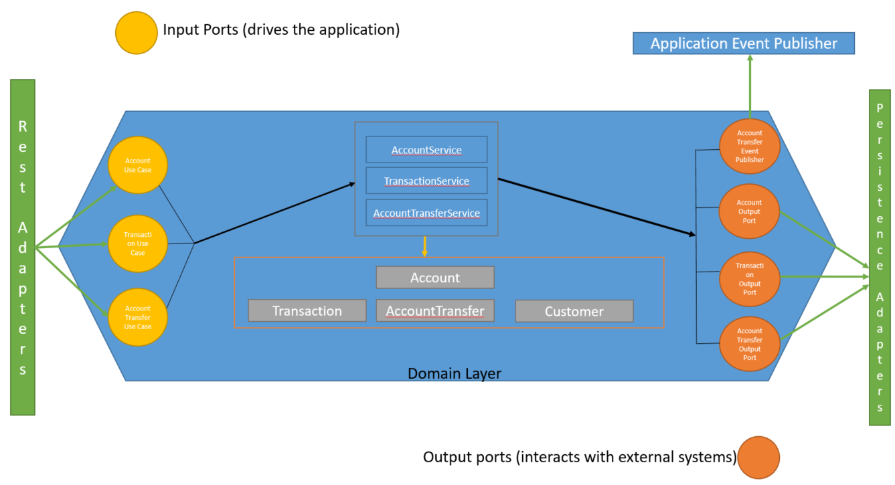
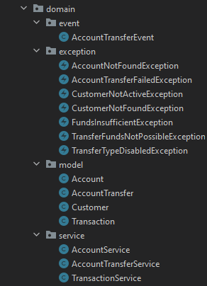

# Spring Boot Testing with a mini banking app in an Hexagonal Architecture
## Introduction
This was supposed to be my talk at the MSCC DevCon 2022 but due to some unforeseen circumstances, I could not present at the conference. I put up quite some work in that
and definitely want to share that with you all, especially Beginners and Intermediate Developers too.
To be honest, I have heard the hexagonal architecture only this year and I wanted to experience with that architecture instead of the classical way we do things
usually. The application I have built is a mini banking app, a very basic app. I am not following great coding principles here. It is an easy one to follow and also the tests as well in this domain would be
make more sense.
My talk is focused mostly on how to write unit and integration testing for a Spring Boot App and to see the capabilities
offered by the Framework.
## Architecture of the Application

The main idea, IMHO, behind a hexagonal architecture is to keep the domain logic free/independent of any
framework so that the code can be easily transported that to any framework. The mini application consists of the following features:
1. Get bank accounts for a customer.
2. Get transactions for a particular bank account number.
3. Perform a transfer between two bank accounts.
4. The application will generate an event upon a successful account transfer.
### Setting up of the application
You will need keycloak up and running to be able to run the application. Below are the docker-compose commands:
```yaml
version: '2'
services:
  postgresql:
    image: docker.io/bitnami/postgresql:11
    environment:
      # ALLOW_EMPTY_PASSWORD is recommended only for development.
      - ALLOW_EMPTY_PASSWORD=yes
      - POSTGRESQL_USERNAME=bn_keycloak
      - POSTGRESQL_DATABASE=bitnami_keycloak
    volumes:
      - 'postgresql_data:/bitnami/postgresql'

  keycloak:
    image: docker.io/bitnami/keycloak:19
    depends_on:
      - postgresql
    ports:
      - "80:8080"

volumes:
  postgresql_data:
    driver: local

```
Once up, please import the [realm](test-realm.json). All configuration will be done accordingly.
I am also attaching the postman collection for you to test. Download [here](Banking%20App.postman_collection.json). Once you are done importing the postman collection and
you are getting successful responses, I invite you to go through the code and try to understand. I did my optimum best to write comments throughout the code. I will focus more on the 
tests though in this documentation.
### Testing Strategy
I am sure that you know the testing pyramid and that integration and end-to-end tests are quite expensive to write. So you need
to focus mostly on unit testing as they give you fast feedback, blabla and blabla. LOL!
You can definitely pick up some books and read on this. Let's not waste time.
### Domain layer testing
For this part as per structure, you would agree with me that since this code is free of any Spring related configuration or annotation, we need to 
write unit tests.



Let's have a look at the method **createAccountTransfer** in the class **AccountTransferService**.
```java
@ExtendWith(MockitoExtension.class)
class AccountTransferServiceTest {

    @Mock
    private AccountService accountService;
    @Mock
    private AccountTransferOutputPort accountTransferOutputPort;
    @Mock
    private AccountTransferEventPublisher accountTransferEventPublisher;
    @InjectMocks
    private AccountTransferService accountTransferService;
    @Captor
    private ArgumentCaptor<AccountTransfer> accountTransferArgumentCaptor;
    @Captor
    private ArgumentCaptor<AccountTransferEvent> accountTransferEventArgumentCaptor;

    @Test
    @DisplayName("This test should create a successful transfer with funds being deducted from the sender account and funds being credited to the receiver account")
    void should_return_a_successful_account_transfer() {
        Mockito.when(this.accountService.getAccountByAccountNumber(ArgumentMatchers.anyString())).thenReturn(getSenderAccount()).thenReturn(getReceiverAccount());
        Mockito.when(this.accountTransferOutputPort.saveAccountTransfer(ArgumentMatchers.any(AccountTransfer.class))).thenReturn(getSuccessfulAccountTransfer());
        var accountTransfer = this.accountTransferService.createAccountTransfer(getAccountTransfer());
        Assertions.assertThat(accountTransfer).isNotNull();
        Assertions.assertThat(accountTransfer.getStatus()).isEqualTo("SUCCESS");
        Mockito.verify(this.accountService, Mockito.times(2)).getAccountByAccountNumber(ArgumentMatchers.anyString());
        Mockito.verify(this.accountTransferOutputPort, Mockito.times(1)).saveAccountTransfer(this.accountTransferArgumentCaptor.capture());
        var accountTransferModel = this.accountTransferArgumentCaptor.getValue();
        var senderAccount = accountTransferModel.getSenderAccount();
        var receiverAccount = accountTransferModel.getReceiverAccount();
        Assertions.assertThat(senderAccount.getCurrentBalance()).isEqualTo(99.00);
        Assertions.assertThat(receiverAccount.getCurrentBalance()).isEqualTo(101.00);
        Mockito.verify(this.accountTransferEventPublisher, Mockito.times(1)).publishSuccessfulTransferEvent(this.accountTransferEventArgumentCaptor.capture());
        var accountTransferEvent = this.accountTransferEventArgumentCaptor.getValue();
        Assertions.assertThat(accountTransferEvent.getReference()).isEqualTo("139f34e2-daf1-462c-966a-6660018c31c9");
    }
}
```
As from Junit5, to be able to use mockito alongside, you need to use the annotation ExtendWith and the extension MockitoExtension.
With that, you just need annotate your dependency classes with @Mock and the class under test with @InjectMocks.
There is one more particular annotation, Captor, that is really useful in some cases when you need to inspect arguments of method of mocked objects.
You really get to assert whether some objects are being constructed as it should be. 

Also do not forget to always verify your mocked objects to make sure that the actual method is being called.

### Integration Testing
This is the most interesting part. In my opinion, where this testing capability is really helpful, is when you need to test your feature and to be able to test it 
especially in large environments where you can't test locally and the only option is to deploy your application for instance on a Kubernetes Cluster 
with 30 microservices. You have to make your build and then release it. All this takes times. 

Instead of booting up the full application context (which takes time) and run tests against the latter, you can perform
sliced tests i.e. perform testing at different layers such as web or DB, which eventually will make your tests faster as 
only specific spring components respective to the layer will be present.

#### Web layer Testing
Let's have a look at one class and 2 methods in it.
```java
@WebMvcTest(AccountTransferRestAdapter.class)
@Import(value = JwtSecurityConfig.class)
class AccountTransferRestAdapterTest {

    @Autowired
    private MockMvc mockMvc;
    @MockBean
    private AccountTransferUseCase accountTransferUseCase;

    @Test
    @DisplayName("This test should return a successful account transfer provided the user has the roles PAY and the request body is valid")
    @WithMockUser(username = "1012", roles = {"USER", "PAY"})
    void should_return_successful_transfer_for_existing_customer() throws Exception {
        Mockito.when(this.accountTransferUseCase.createAccountTransfer(ArgumentMatchers.any(AccountTransfer.class))).thenReturn(getSuccessfulAccountTransfer());
        this.mockMvc.perform(MockMvcRequestBuilders.post("/v1/transfers").with(csrf())
                        .contentType(MediaType.APPLICATION_JSON)
                        .content(this.writeObjectAsJson(buildAccountTransferRequest())))
                .andExpect(status().isCreated())
                .andExpect(jsonPath("$.reference").value("139f34e2-daf1-462c-966a-6660018c31c9"));
    }

    @Test
    @DisplayName("This test should return 403 as the user does not have the role of PAY")
    @WithMockUser(username = "1012")
    void should_return_403_for_existing_customer_with_incorrect_roles() throws Exception {
        this.mockMvc.perform(MockMvcRequestBuilders.post("/v1/transfers").with(csrf())
                        .contentType(MediaType.APPLICATION_JSON)
                        .content(this.writeObjectAsJson(buildAccountTransferRequest())))
                .andExpect(status().isForbidden());
    }
}
```
This [link](https://docs.spring.io/spring-boot/docs/current/api/org/springframework/boot/test/autoconfigure/web/servlet/WebMvcTest.html) is very self-explanatory explaining
testing related to Spring MVC components only. As per our application, all our endpoints are protected using this below Http Security Configuration.

```java
@Configuration
public class JwtSecurityConfig {
    @Bean
    public SecurityFilterChain filterChain(HttpSecurity http) throws Exception {
        http.authorizeRequests(authz -> authz.antMatchers(HttpMethod.GET, "/v1/customers/**", "/v1/accounts/**")
                        .hasRole("USER")
                        .antMatchers(HttpMethod.POST, "/v1/transfers/**")
                        .hasRole("PAY")
                        .anyRequest()
                        .authenticated())
                .oauth2ResourceServer(httpSecurityOAuth2ResourceServerConfigurer -> httpSecurityOAuth2ResourceServerConfigurer.jwt(jwtConfigurer -> jwtConfigurer.jwtAuthenticationConverter(jwtAuthenticationConverter())));
        return http.build();
    }

    JwtAuthenticationConverter jwtAuthenticationConverter() {
        var jwtAuthenticationConverter = new JwtAuthenticationConverter();
        jwtAuthenticationConverter.setJwtGrantedAuthoritiesConverter(new KeycloakRealmRoleConverter());
        return jwtAuthenticationConverter;
    }

    /**
     * Reading the JWT token to get roles from the claims.
     */
    static class KeycloakRealmRoleConverter implements Converter<Jwt, Collection<GrantedAuthority>> {
        public Collection<GrantedAuthority> convert(final Jwt jwt) {
            final Map<String, Object> realmAccess = (Map<String, Object>) jwt.getClaims().get("realm_access");
            return ((List<String>)realmAccess.get("roles")).stream()
                    .map(roleName -> "ROLE_" + roleName)
                    .map(SimpleGrantedAuthority::new)
                    .collect(Collectors.toList());
        }
    }
}
```
Our application is an Oauth2 Resource Server, which requires a valid JWT provided by an Authorization Server, which will then
validate the token based on the configuration provided in the application.properties. In summary to access the endpoints, the user
should have roles and this we need to test properly.

With the annotation [@WithMockUser](https://docs.spring.io/spring-security/site/docs/4.0.x/apidocs/org/springframework/security/test/context/support/WithMockUser.html),
it creates a user with roles that are specified, making sure that your HTTP Security Configuration is being well tested. For the test **should_return_403_for_existing_customer_with_incorrect_roles()**, if the 
user does not have the roles PAY, the status returned will be forbidden.

#### Database Layer Testing

This is also very important to make sure that the entities are being persisted properly to the DB that will be actually used on
production environment. TestContainers allows you to bring up the DB in docker as a container and then with @DataJPATest, only the
Components related to such as Repository/JPA will be created in the context. 

There are some common configuration that I have decided to put in a parent class and then all persistence classes related tests
extend the latter.

```java
@DataJpaTest
@AutoConfigureTestDatabase(replace = AutoConfigureTestDatabase.Replace.NONE)
@Testcontainers
@ActiveProfiles(value = "mysql")
@ContextConfiguration(classes = TestConfigPersistenceComponent.class)
@DirtiesContext(classMode = DirtiesContext.ClassMode.AFTER_CLASS)
public abstract class AbstractPersistenceAdapterTest {

    @Container
    private static final MySQLContainer<?> MY_SQL_CONTAINER = new MySQLContainer<>("mysql:5.7.22")
            .withInitScript("init_scripts.sql").withReuse(true);

    @DynamicPropertySource
    static void mySqlProperties(DynamicPropertyRegistry registry) {
        registry.add("spring.datasource.url", () -> MY_SQL_CONTAINER.getJdbcUrl() + "?verifyServerCertificate=false&useSSL=false&requireSSL=false");
        registry.add("spring.datasource.password", MY_SQL_CONTAINER::getPassword);
        registry.add("spring.datasource.username", MY_SQL_CONTAINER::getUsername);
    }

}
```
The DB that we are going to use is MySQL and we have defined an application properties file accordingly for MySQL. As per the
annotation @DataJPATest which scans only the Spring JPA components, we would need other beans as well so that our tests
work correctly. We have defined a TestConfiguration class as per below.
```java
@TestConfiguration
@ComponentScan(basePackages = "com.example.msccspringtesting.infrastructure.adapters.output.persistence")
public class TestConfigPersistenceComponent {
}
```

The annotation **@DirtiesContext(classMode = DirtiesContext.ClassMode.AFTER_CLASS)** actually clears the context after each test. The
reason we are doing that is because for every persistence being run, a new container will be created and hence the database
url changes. So we need to recreate a new context for each test so that the properties are refreshed.

#### Spring Caching Integration Test

This is also another interesting part where you can test Spring Caching capabilities. Regarding the feature that has been developed,. 
the accounts are cached as the customer ID being the key, when it is being retrieved from the database. And then when the account is being
updated for 1 customer, it will clear the accounts for that customer only as it is no more valid. So when the user will get accounts
later, it will retrieve from the DB. Let's have a look at the first test method.

```java
@SpringJUnitConfig(AccountCachingTest.CachingTestConfig.class)
class AccountCachingTest {

    @Autowired
    private AccountOutputPort accountPersistenceAdapterUnderTest;
    @Autowired
    private AccountRepository accountRepository;
    @Autowired
    private AccountMapper accountMapper;
    @Autowired
    private CacheManager cacheManager;

    @TestConfiguration
    @EnableCaching
    public static class CachingTestConfig {

        @Bean
        public AccountOutputPort accountPersistenceAdapter() {
            return new AccountPersistenceAdapter(accountRepository(), accountMapper());
        }

        @Bean
        public AccountRepository accountRepository() {
            return Mockito.mock(AccountRepository.class);
        }

        @Bean
        public AccountMapper accountMapper() {
            return Mockito.mock(AccountMapper.class);
        }

        @Bean
        public CacheManager cacheManager() {
            return new ConcurrentMapCacheManager("users");
        }
    }

    @BeforeEach
    void setUp() {
        this.cacheManager.getCache("users").clear();
        Mockito.reset(accountRepository);
        Mockito.reset(accountMapper);
    }

    @Test
    void should_store_accounts_inCache_for_customer_On_SecondCall() {
        Mockito.when(this.accountRepository.findAllByCustomerId(ArgumentMatchers.anyLong())).thenReturn(List.of(new AccountEntity()));
        Mockito.when(this.accountMapper.entityToModel(ArgumentMatchers.any(AccountEntity.class))).thenReturn(getSenderAccount());
        Assertions.assertThat(this.cacheManager.getCache("users").get("1012")).isNull();
        List<Account> accounts = this.accountPersistenceAdapterUnderTest.getAccountByCustomerRefId("1012");
        Assertions.assertThat(accounts).hasSize(1);
        Cache.ValueWrapper accountList = this.cacheManager.getCache("users").get("1012");
        List<Account> accountList1 = (List<Account>) accountList.get();
        Assertions.assertThat(accountList1).isNotNull().hasSize(1);
        List<Account> accountsFromCache = this.accountPersistenceAdapterUnderTest.getAccountByCustomerRefId("1012");
        Assertions.assertThat(accountsFromCache).hasSize(1);
        Mockito.verify(this.accountRepository, Mockito.times(1)).findAllByCustomerId(ArgumentMatchers.anyLong());
        Mockito.verify(this.accountMapper, Mockito.times(1)).entityToModel(ArgumentMatchers.any(AccountEntity.class));
    }

    @Test
    void should_store_accounts_inCache_and_clear_on_update() {
        Mockito.when(this.accountRepository.findAllByCustomerId(ArgumentMatchers.anyLong())).thenReturn(List.of(new AccountEntity()));
        Mockito.when(this.accountMapper.entityToModel(ArgumentMatchers.any(AccountEntity.class))).thenReturn(getSenderAccount());
        Mockito.when(this.accountMapper.modelToEntity(ArgumentMatchers.any(Account.class))).thenReturn(getSenderAccountEntity());
        Mockito.when(this.accountRepository.save(ArgumentMatchers.any(AccountEntity.class))).thenReturn(getSenderAccountEntity());
        Assertions.assertThat(this.cacheManager.getCache("users").get("1012")).isNull();
        List<Account> accounts = this.accountPersistenceAdapterUnderTest.getAccountByCustomerRefId("1012");
        Assertions.assertThat(accounts).hasSize(1);
        Cache.ValueWrapper accountList = this.cacheManager.getCache("users").get("1012");
        List<Account> accountList1 = (List<Account>) accountList.get();
        Assertions.assertThat(accountList1).isNotNull().hasSize(1);
        this.accountPersistenceAdapterUnderTest.updateAccount(getSenderAccount());
        Assertions.assertThat(this.cacheManager.getCache("users").get("1012")).isNull();
        List<Account> accountsSecondCall = this.accountPersistenceAdapterUnderTest.getAccountByCustomerRefId("1012");
        Assertions.assertThat(accountsSecondCall).hasSize(1);
        Mockito.verify(this.accountRepository, Mockito.times(2)).findAllByCustomerId(ArgumentMatchers.anyLong());
        Mockito.verify(this.accountRepository, Mockito.times(1)).save(ArgumentMatchers.any(AccountEntity.class));
        Mockito.verify(this.accountMapper, Mockito.times(3)).entityToModel(ArgumentMatchers.any(AccountEntity.class));
    }
}
```

We are using SpringJunitConfig annotation and loading the test configuration class which comprises the beans we need to perform
this test. So the first test **should_store_accounts_inCache_for_customer_On_SecondCall()** we are looking is when retrieving records from the DB, it should be cached so that the second time
we are retrieving the accounts, it should not be fetched from DB but from the cache. If you see properly, we are calling the method
**getAccountByCustomerRefId()** twice but on verifying the mock, it is getting called only once.

In the second test method **should_store_accounts_inCache_and_clear_on_update()**, we want to make sure that cache get cleared
when updating the account so that it is retrieved from the DB on the second call.

#### Aspect Integration Testing

Let's go one step further and check whether the event is being generated for a successful account transfer. At the same time, we will test the aspect that is checking whether 
the user is active and whether the payment type is allowed. Let's have a look at the code.

```java
@SpringBootTest
@EnableConfigurationProperties(PaymentTypesConfig.class)
@TestPropertySource(value = "classpath:application.properties")
@Import(value = CreateAccountTransferIT.EventConsumer.class)
class CreateAccountTransferIT {

    @Autowired
    private AccountTransferService accountTransferService;
    @SpyBean
    private EventConsumer eventConsumer;

    @TestComponent
    @Slf4j
    public static class EventConsumer {
        @EventListener
        public void getEvents(AccountTransferEvent accountTransferEvent) {
            log.info("Event consumed {}", accountTransferEvent);
        }
    }

    @Test
    @WithCustomMockUser(username = "1022")
    @Sql(scripts = "classpath:init_scripts.sql")
    @Order(1)
    void should_publish_event_for_successful_transfer() {
        this.accountTransferService.createAccountTransfer(buildAccountTransferSuccessful());
        Mockito.verify(this.eventConsumer, Mockito.times(1)).getEvents(ArgumentMatchers.any(AccountTransferEvent.class));
    }

    @Test
    @WithCustomMockUser(username = "1025")
    @Order(2)
    void should_not_publish_event_for_disabled_customer() {
        Assertions.assertThatThrownBy(() -> this.accountTransferService.createAccountTransfer(buildAccountTransferSuccessful())).isInstanceOf(CustomerNotActiveException.class);
        Mockito.verify(eventConsumer, Mockito.times(0)).getEvents(ArgumentMatchers.any(AccountTransferEvent.class));
    }
}
```
We are no more making a sliced test since we are using the annotation @SpringBootTest, which will create all beans and set up 
an application context with all these beans allowing us to test all the layers of the application. Since the application is generating
an event, we can create an event listener that will consume the events. For that, we are using the annotation @TestComponent 
to create a component which will consume events of type AccountTransferEvent. 

Moreover, in the aspect we have defined, we are retrieving a claim fom the JWT that is the username of the customer.
Whenever we are logging in the application, an object of type JwtAuthenticationToken is created in 
the Spring Security Context Holder. So we need to find a way to create same. Remember the annotation @WithMockUser, 
we are doing something similar and creating our own. 

```java
public class WithMockUserSecurityContextFactory
        implements WithSecurityContextFactory<WithCustomMockUser> {

    private static final String tokenValue ="eyJhbGciOiJSUzI1NiIsInR5cCIgOiAiSldUIiwia2lkIiA6ICJOLVRKOFJFZi1pQ0VMZUVLa010cHVVT2hTQk9hdkRkejMxZGZrN1V1cEY4In0.eyJleHAiOjE2Njg5MjYxNTEsImlhdCI6MTY2ODkyNTg1MSwianRpIjoiODY1ZDc4YzgtZjZmOS00OTJkLThjMzctNWYwOTExMmI4Njg1IiwiaXNzIjoiaHR0cDovL2xvY2FsaG9zdC9yZWFsbXMvdGVzdC1yZWFsbSIsImF1ZCI6ImFjY291bnQiLCJzdWIiOiI1NzM5YmNkMy0xMmUwLTQyOGItOTQwZi1lNzMxZmY5ZjA1MTEiLCJ0eXAiOiJCZWFyZXIiLCJhenAiOiJzcHJpbmctYm9vdC1jbGllbnQiLCJzZXNzaW9uX3N0YXRlIjoiZDA0Y2ZiNmUtYWM3Yy00Mjc5LThiODAtMTgwZTdiMWRjMGUxIiwiYWNyIjoiMSIsInJlYWxtX2FjY2VzcyI6eyJyb2xlcyI6WyJkZWZhdWx0LXJvbGVzLXRlc3QtcmVhbG0iLCJvZmZsaW5lX2FjY2VzcyIsIlBBWSIsInVtYV9hdXRob3JpemF0aW9uIiwiVVNFUiJdfSwicmVzb3VyY2VfYWNjZXNzIjp7ImFjY291bnQiOnsicm9sZXMiOlsibWFuYWdlLWFjY291bnQiLCJtYW5hZ2UtYWNjb3VudC1saW5rcyIsInZpZXctcHJvZmlsZSJdfX0sInNjb3BlIjoicHJvZmlsZSBlbWFpbCIsInNpZCI6ImQwNGNmYjZlLWFjN2MtNDI3OS04YjgwLTE4MGU3YjFkYzBlMSIsImVtYWlsX3ZlcmlmaWVkIjp0cnVlLCJuYW1lIjoiVGhlIFJvY2siLCJwcmVmZXJyZWRfdXNlcm5hbWUiOiIxMDI0IiwiZ2l2ZW5fbmFtZSI6IlRoZSIsImZhbWlseV9uYW1lIjoiUm9jayIsImVtYWlsIjoiMTAyNEB0ZXN0LmNvbSJ9.DGChP_lICcf640RXY1KVL5DTjyYbdrVd64-Ngp9JsinRtrYwh-or2o1ti3J-QwahhVkDTfyuFZMzrUYv7rNd5eqYvPXT5BUDEmrcZV-Yui5OlFxrN4sZT2JtkdaCS5naj82KFepVcDkUYP6RpanqJL6j_7Vlgg_DkDXvL-eLHb6jUAjmJ1VZint8EOtgkYpjzsHc-BelXgcFfLPU-5V_mC1jFkCG9o4fIsx7JSMS_BphnHq81dl119g65XsQUVnNoCsAIgsD6vDtYcnwBVRg6R1jAsL4QwSxVLsjxGsYPMdc33LhO4Am-KODjdAAgcSjS7tJzPlFsHwuTOjZgh4QMA";
    @Override
    public SecurityContext createSecurityContext(WithCustomMockUser customUser) {
        SecurityContext context = SecurityContextHolder.createEmptyContext();
        Jwt jwt = Jwt.withTokenValue(tokenValue).claim("preferred_username", customUser.username())
                .header("alg", "HS256")
                .header("typ", "JWT")
                .build();

        Authentication authentication = new JwtAuthenticationToken(jwt);
        context.setAuthentication(authentication);
        return context;
    }
}
```
In the above code, we are creating the JwtAuthenticationToken and then setting the claim with the 
method argument. Running the test, we are able to verify that the event listener is consuming the events.